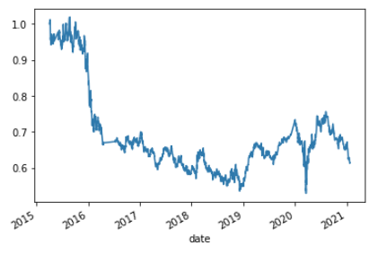
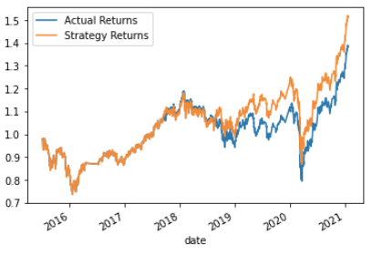
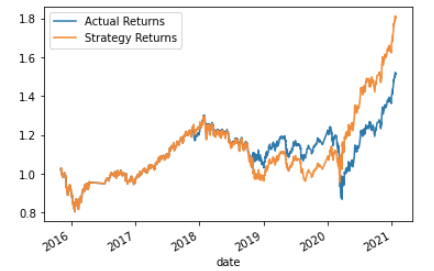
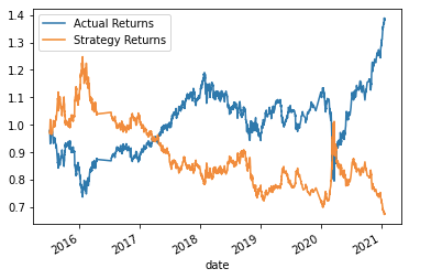
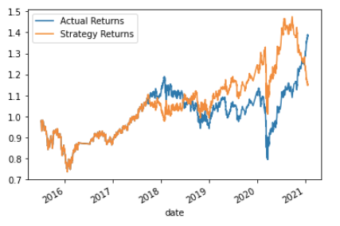
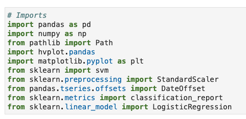

# Algorithmic_Trading

# Overview

This project aims at deploying a trading bot capable of trading based on an algorithm which will execute buy and sell orders in accordance with a trading strategy

I was provided with a dataset of emerging_markets_ohlcv.csv file which was read by python and converted into a dataframe filtered into two columns "Close and Actual Returns" calculated thanks to the pct function and dropna to drop the nan values, after that we generate the trading signals with short and long windows SMA values. Then with the creation of the signals 1, -1 been 1 the buy order and -1 the sell order. We calculate the Strategy Returns by multipliyng the actual returns by the signal values

Then we split the data in training and testing datsets and slicing the time period for the training datasets to 3 months, we used the SVC classifier to fit train and make predictions based on the testing data. after that we review the classification report associated with the SVC model.

# Conclusion 
the performance of the baseline trading algorithm in this 1st fase is giving us a result that the Strategy performs almost the same as the actual returns until the 3Q aproximatly of 2018. There is when the Strategy start to return better results till now.

# Tune the Baseline Trading Algorithm

What impact resulted from increasing or decreasing the training window?
When I modified the size of the training dataset slicing my data in diferent time periods I notice this: When I lower the time period the accuracy of the predictions was lower compaired when I increase the time period obtaining the best results with a 7 months time period  

What impact resulted from increasing or decreasing either or both of the SMA windows?
After modifiing multiple times the SMA windows up and down I found that the best combo was the original one.  short window 4 SMA and long window 100 SMA Giving me the best accuracy in the report and the best returns in the chart "Actual Returns VS Strategy Returns"

# Evaluate a New Machine Learning Classifier
For this fase of the project I choose the Logistic Regression classifier after I try first the Decision tree classifier I try both but the best results came out from the LR

Did this new model perform better or worse than the provided baseline model? Did this new model perform better or worse than your tuned trading algorithm?
This model performs better at some points in the time period but at the end came down on the results and perform worst than my tuned trading algorithm

# Conclusion 

the performance of the tuned trading algorithm was better overall compaired to the baseline and the Logistic Regression model

---

## Technologies

This setup assumes you already have conda installed.

This project leverages python 3.7 with the following packages:

---

---
## Contributors

Israel Fernandez

---
